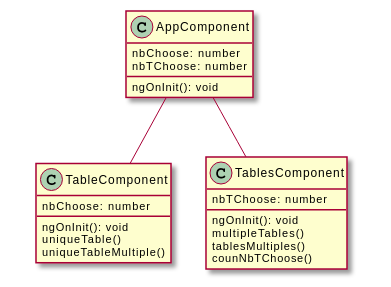

# Table de multiplication
## Objectif
Ce projet à pour objectif la réalisation d'une application web, permet d'afficher des tables de multiplications.

## Partie 1

### Table unique
Pour la première partie du projet, il est demandé, la création, d'une table de multiplication unique. L'utilisateur pourra sur celle-ci, entrer un nombre correspondant à la table de multiplication souhaité.

```html
<!-- /src/app/table.component.html -->
<!-- [Angular] => input & button -->
<div class="column is-half">
	<form [formGroup]="tableChoose" (ngSubmit)="uniqueTable()">
		<div class="field">
			<label class="label">Number</label>
			<div class="control">
				<input class="input" formControlName="nbInput" type="number" placeholder="Enter a number" value=""/>
			</div>
		</div>
		<div class="field">
			<div class="control">
				<button class="button" type="submit">Submit</button>
			</div>
		</div>
	</form>
</div>

<!-- [Table] => step01 : choose the table to show (unique)-->
<div class="column is-half">
	<table class="table">
		<tr *ngFor="let inc of uniqueTableMultiple()">
			<td>
				{{ nbChoose }}
				x
				{{ inc/nbChoose }}
				=
				{{ inc }}</td>
		</tr>
	</table>
</div>
```

<quote>🚨 Pour activer les "formulaires réactives" :
```ts
// /src/app/app.modules.ts
...
import { ReactiveFormsModule } from '@angular/forms';
...
  imports: [
    ...
    ReactiveFormsModule
```
 </quote>

```ts
// /src/app/table.component.ts
import { Component, Input, OnInit } from '@angular/core';
import { FormControl, FormGroup } from '@angular/forms';

@Component({
  selector: 'app-table',
  templateUrl: './table.component.html',
  styleUrls: ['./table.component.css']
})
export class TableComponent implements OnInit {

  tableChoose!: FormGroup;
  @Input() nbInput!: number;
  nbChoose: number = 0;

  constructor() { }

  get formControls() { return this.tableChoose.controls; }

  ngOnInit(): void {
    this.tableChoose = new FormGroup({
      nbInput: new FormControl(),
    });
  }

  uniqueTable() {
    let valInput = this.tableChoose.value.nbInput;
    this.nbChoose = valInput;
  }

  uniqueTableMultiple() {
    let table: number[] = [];

    if (this.nbChoose) {
      for(let i=0; i<=10; i++) {
        let inc = (this.nbChoose * i);
        table.push(inc);
        // debug
        console.log("val of inc : " + inc);
      }
      return table;
    }
    return table;
  }
}

```

## Partie 2

### Table Multiple
Pour la deuxième partie du projet, il est demandé, la création, d'une table de multiplication pouvant être multiplié, selon un nombre donnée en entrée. L'utilisateur pourra sur celle-ci, entrer un nombre correspondant au nombre de table de multiplication souhaité.

```html
<!-- /src/app/tables.component.html -->
<!-- [Angular] => input & button -->
<div class="column is-half">
	<form [formGroup]="tablesChoose" (ngSubmit)="multipleTables()">
		<div class="field">
			<label class="label">Number</label>
			<div class="control">
				<input class="input" formControlName="nbTInput" type="number" placeholder="Enter a number" value=""/>
			</div>
		</div>
		<div class="field">
			<div class="control">
				<button class="button" type="submit">Submit</button>
			</div>
		</div>
	</form>
</div>

<!-- [Table] => step02 : choose the tables to show (multiple)-->
<div class="column is-half">
	<table class="table">

	<tbody>
		<tr *ngFor="let incT of tablesMultiples()">
				<td>Res : {{ incT }}</td>
		</tr>
	</tbody>
	
	</table>
</div>
```

```ts
// /src/app/tables.component.ts
import { Component, Input, OnInit } from '@angular/core';
import { FormControl, FormGroup } from '@angular/forms';

@Component({
  selector: 'app-tables',
  templateUrl: './tables.component.html',
  styleUrls: ['./tables.component.css']
})
export class TablesComponent implements OnInit {

  tablesChoose!: FormGroup;
  @Input() nbTInput!: number;
  nbTChoose: number = 0;
  
  constructor() { }

  get formControls() { return this.tablesChoose.controls; }

  ngOnInit(): void {
    this.tablesChoose = new FormGroup({
      nbTInput: new FormControl(),
    });
  }

  multipleTables() {
    let valTInput = this.tablesChoose.value.nbTInput;
    this.nbTChoose = valTInput;
  }

  tablesMultiples() {
    let tables: number[] = [];

    if(this.nbTChoose) {
      for(let x=1; x<= this.nbTChoose; x++) {
        for(let i=0; i<=10; i++) {
          let incT = (x * i);
          tables.push(incT);
          // debug
          console.log("val of incT : " + incT);
        }
      }
      return tables;
    }
    return tables;
  }

  countNbTChoose() {
    let nbT: number[] = [];

    if(this.nbTChoose) {
      for(let y=1; y<=this.nbTChoose; y++) {
        let incN = y;
        nbT.push(y);
        // debug
        console.group("val of incN : " + incN);
      }
      return nbT;
    }
    return nbT;
  }

}

```

## Représentation UML des classes

